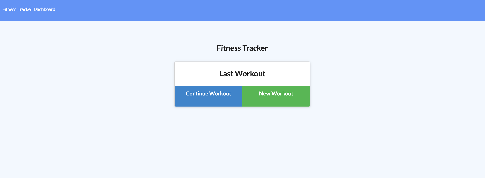

# Fitness Tracker

This is a workout tracking application. This app includes a Mongo database with a Mongoose schema that handles routes with Express.

[Deployed Heroku App](https://fitness-application-idallas93.herokuapp.com/ "Deployed Heroku App")

## Images of working Application
Inline-style: 

## User Story

* The user is able to view, create and track daily workouts. The user can also log multiple exercises in a workout on a given day and is able to track the name, type, weight, sets, reps, and duration of exercise. If the exercise is cardio, the user can track distance traveled.

## Details

When the user loads the page, they are given the option to create a new workout or continue with their last workout.

The user is able to:

  * Add exercises to a previous workout plan.

  * Add new exercises to a new workout plan.

  * View the combined weight of multiple exercises on the `stats` page.

The application is deployed with a MongoDB database to Heroku.
  * [Set Up MongoDB Atlas](../04-Important/MongoAtlas-Setup.md)

  * [Deploy with Heroku and MongoDB Atlas](../04-Important/MongoAtlas-Deploy.md)

